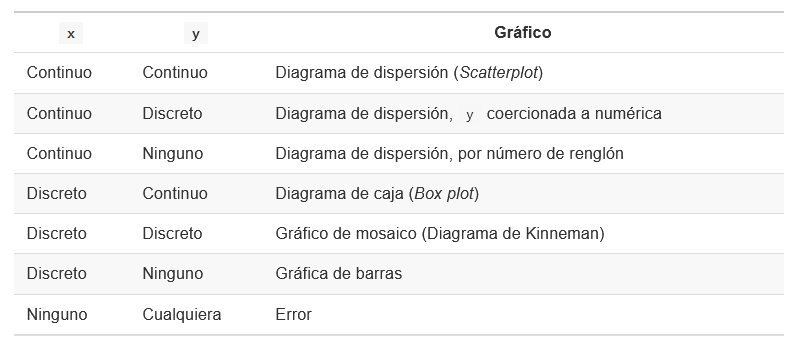

```{r}
knitr::opts_chunk$set(echo = TRUE, message = FALSE, warning = FALSE)
```


R cuenta con un sistema de generación de gráficas poderosas y flexibles; sin embargo, su uso requiere de mucha práctica y paciencia.

Para los ejemplos emplearemos la base de datos disponible en [UCI Machine Learning Repository](https://archive.ics.uci.edu/ml/index.php). Emplearemos el conjunto de datos denominado "Bank Marketing Data Set" que contiene información de personas contactadas en una campaña de marketing directo puesta en marcha por un banco de Portugal.

```{r}
#Importamos lo datos
download.file(
  url = "https://raw.githubusercontent.com/jboscomendoza/r-principiantes-bookdown/master/datos/bank.csv", 
  destfile = "bank.csv"
  )

```

```{r}
readLines("bank.csv", n = 4)

#Por la estructura de datos podemos usar la función read.csv, con el argumento sep = ";"

banco <- read.csv("bank.csv", sep = ";")
head(banco)
```

```{r}
#Cómo conocemos las dimensiones del dataframe?
dim(banco)

#Determinamos la clase de cada variable
lapply(banco, class)

#Resumen de nuestra base de datos
summary(banco)
```


# FUNCIÓN PLOT

La función `plot()` es usada de manera general para crear gráficos en R. Así mismo, podemos ajustar diferentes parámetros para controlar el aspecto y dimensión de los gráficos.

`plot()` siempre pide un argumento `x`, que corresponde al **eje X** de una gráfica.  `x` requiere un vector y si no especificamos este argumento, obtendremos un error y no se creará la gráfica. El resto de los argumentos de `plot()` son opcionales, pero el más importante es `y`. Este argumento también requiere un vector y corresponde al **eje Y** de la gráfica.  

Dependiendo del tipo de dato que sea `x` o `y` tendremos un gráfico específico de acuerdo a las siguientes reglas:

```{r}

```

En donde los tipos de dato son:

* **Continuo**: Un vector numérico, entero, lógico o complejo.

* **Discreto**: Un vector de factores o cadenas de texto.

Hay funciones que generan tipos específicos de gráficos como por ejemplo la función `barplot()` o  `hist()`. 


## Histogramas


