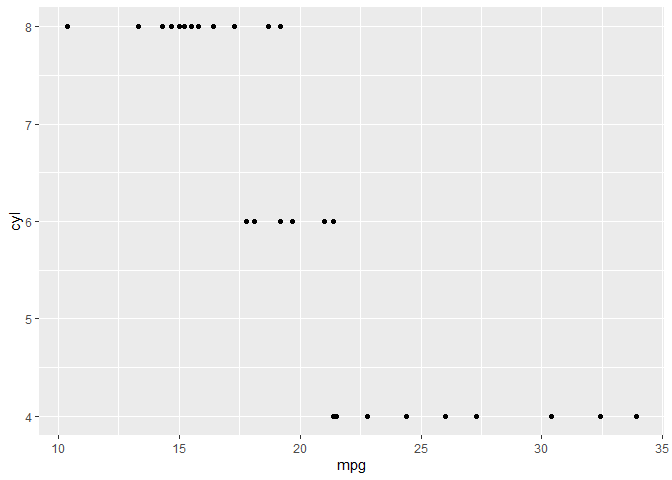

Funciones gráficas en r (paquete graphics and ggplot2)
================

``` r
knitr::opts_chunk$set(echo = TRUE, message = FALSE, warning = FALSE)
```

R cuenta con un sistema de generación de gráficas poderosas y flexibles;
sin embargo, su uso requiere de mucha práctica y paciencia.

Para los ejemplos emplearemos la base de datos disponible en [UCI
Machine Learning Repository](https://archive.ics.uci.edu/ml/index.php).
Emplearemos el conjunto de datos denominado “Bank Marketing Data Set”
que contiene información de personas contactadas en una campaña de
marketing directo puesta en marcha por un banco de Portugal.

``` r
#Importamos lo datos
download.file(
  url = "https://raw.githubusercontent.com/jboscomendoza/r-principiantes-bookdown/master/datos/bank.csv", 
  destfile = "bank.csv"
  )
```

``` r
readLines("bank.csv", n = 4)
```

    ## [1] "\"age\";\"job\";\"marital\";\"education\";\"default\";\"balance\";\"housing\";\"loan\";\"contact\";\"day\";\"month\";\"duration\";\"campaign\";\"pdays\";\"previous\";\"poutcome\";\"y\""
    ## [2] "30;\"unemployed\";\"married\";\"primary\";\"no\";1787;\"no\";\"no\";\"cellular\";19;\"oct\";79;1;-1;0;\"unknown\";\"no\""                                                                
    ## [3] "33;\"services\";\"married\";\"secondary\";\"no\";4789;\"yes\";\"yes\";\"cellular\";11;\"may\";220;1;339;4;\"failure\";\"no\""                                                            
    ## [4] "35;\"management\";\"single\";\"tertiary\";\"no\";1350;\"yes\";\"no\";\"cellular\";16;\"apr\";185;1;330;1;\"failure\";\"no\""

``` r
#Por la estructura de datos podemos usar la función read.csv, con el argumento sep = ";"

banco <- read.csv("bank.csv", sep = ";")
head(banco)
```

    ##   age         job marital education default balance housing loan  contact day
    ## 1  30  unemployed married   primary      no    1787      no   no cellular  19
    ## 2  33    services married secondary      no    4789     yes  yes cellular  11
    ## 3  35  management  single  tertiary      no    1350     yes   no cellular  16
    ## 4  30  management married  tertiary      no    1476     yes  yes  unknown   3
    ## 5  59 blue-collar married secondary      no       0     yes   no  unknown   5
    ## 6  35  management  single  tertiary      no     747      no   no cellular  23
    ##   month duration campaign pdays previous poutcome  y
    ## 1   oct       79        1    -1        0  unknown no
    ## 2   may      220        1   339        4  failure no
    ## 3   apr      185        1   330        1  failure no
    ## 4   jun      199        4    -1        0  unknown no
    ## 5   may      226        1    -1        0  unknown no
    ## 6   feb      141        2   176        3  failure no

``` r
#Cómo conocemos las dimensiones del dataframe?
dim(banco)
```

    ## [1] 4521   17

``` r
#Determinamos la clase de cada variable
lapply(banco, class)
```

    ## $age
    ## [1] "integer"
    ## 
    ## $job
    ## [1] "character"
    ## 
    ## $marital
    ## [1] "character"
    ## 
    ## $education
    ## [1] "character"
    ## 
    ## $default
    ## [1] "character"
    ## 
    ## $balance
    ## [1] "integer"
    ## 
    ## $housing
    ## [1] "character"
    ## 
    ## $loan
    ## [1] "character"
    ## 
    ## $contact
    ## [1] "character"
    ## 
    ## $day
    ## [1] "integer"
    ## 
    ## $month
    ## [1] "character"
    ## 
    ## $duration
    ## [1] "integer"
    ## 
    ## $campaign
    ## [1] "integer"
    ## 
    ## $pdays
    ## [1] "integer"
    ## 
    ## $previous
    ## [1] "integer"
    ## 
    ## $poutcome
    ## [1] "character"
    ## 
    ## $y
    ## [1] "character"

``` r
#Resumen de nuestra base de datos
summary(banco)
```

    ##       age            job              marital           education        
    ##  Min.   :19.00   Length:4521        Length:4521        Length:4521       
    ##  1st Qu.:33.00   Class :character   Class :character   Class :character  
    ##  Median :39.00   Mode  :character   Mode  :character   Mode  :character  
    ##  Mean   :41.17                                                           
    ##  3rd Qu.:49.00                                                           
    ##  Max.   :87.00                                                           
    ##    default             balance        housing              loan          
    ##  Length:4521        Min.   :-3313   Length:4521        Length:4521       
    ##  Class :character   1st Qu.:   69   Class :character   Class :character  
    ##  Mode  :character   Median :  444   Mode  :character   Mode  :character  
    ##                     Mean   : 1423                                        
    ##                     3rd Qu.: 1480                                        
    ##                     Max.   :71188                                        
    ##    contact               day           month              duration   
    ##  Length:4521        Min.   : 1.00   Length:4521        Min.   :   4  
    ##  Class :character   1st Qu.: 9.00   Class :character   1st Qu.: 104  
    ##  Mode  :character   Median :16.00   Mode  :character   Median : 185  
    ##                     Mean   :15.92                      Mean   : 264  
    ##                     3rd Qu.:21.00                      3rd Qu.: 329  
    ##                     Max.   :31.00                      Max.   :3025  
    ##     campaign          pdays           previous         poutcome        
    ##  Min.   : 1.000   Min.   : -1.00   Min.   : 0.0000   Length:4521       
    ##  1st Qu.: 1.000   1st Qu.: -1.00   1st Qu.: 0.0000   Class :character  
    ##  Median : 2.000   Median : -1.00   Median : 0.0000   Mode  :character  
    ##  Mean   : 2.794   Mean   : 39.77   Mean   : 0.5426                     
    ##  3rd Qu.: 3.000   3rd Qu.: -1.00   3rd Qu.: 0.0000                     
    ##  Max.   :50.000   Max.   :871.00   Max.   :25.0000                     
    ##       y            
    ##  Length:4521       
    ##  Class :character  
    ##  Mode  :character  
    ##                    
    ##                    
    ## 

# FUNCIÓN PLOT

La función `plot()` es usada de manera general para crear gráficos en R.
Así mismo, podemos ajustar diferentes parámetros para controlar el
aspecto y dimensión de los gráficos.

`plot()` siempre pide un argumento `x`, que corresponde al **eje X** de
una gráfica. `x` requiere un vector y si no especificamos este
argumento, obtendremos un error y no se creará la gráfica. El resto de
los argumentos de `plot()` son opcionales, pero el más importante es
`y`. Este argumento también requiere un vector y corresponde al **eje
Y** de la gráfica.

Dependiendo del tipo de dato que sea `x` o `y` tendremos un gráfico
específico de acuerdo a las siguientes reglas:

``` r
knitr::include_graphics("imagenes/tipoDatoPlot.PNG")
```

<!-- -->

En donde los tipos de dato son:

-   **Continuo**: Un vector numérico, entero, lógico o complejo.

-   **Discreto**: Un vector de factores o cadenas de texto.

Hay funciones que generan tipos específicos de gráficos como por ejemplo
la función `barplot()` o `hist()`.

## Histogramas

``` r
library(ggplot2)
library(tidyverse)
mtcars %>% 
  ggplot(aes(mpg, cyl)) +
  geom_point()
```

<!-- -->
