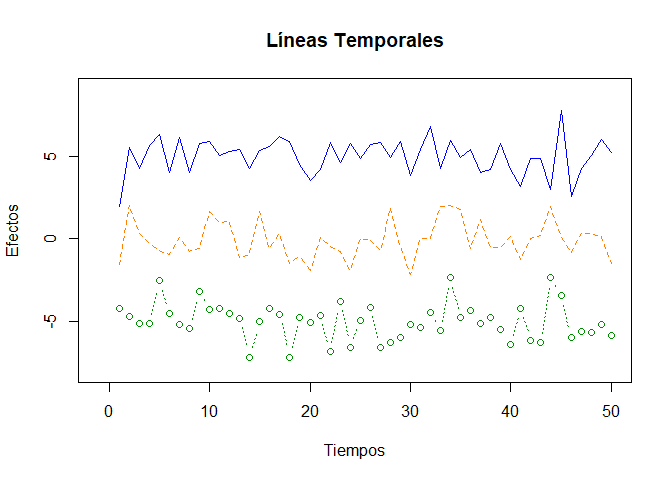
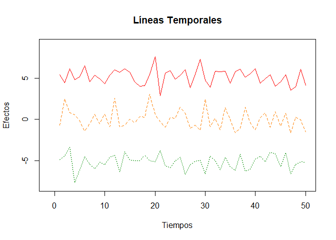

Funciones gráficas en r (paquete graphics and ggplot2)
================

R cuenta con un sistema de generación de gráficas poderosas y flexibles;
sin embargo, su uso requiere de mucha práctica y paciencia.

Para los ejemplos emplearemos la base de datos disponible en [UCI
Machine Learning Repository](https://archive.ics.uci.edu/ml/index.php).
Emplearemos el conjunto de datos denominado “Bank Marketing Data Set”
que contiene información de personas contactadas en una campaña de
marketing directo puesta en marcha por un banco de Portugal.

``` r
#Importamos lo datos
# download.file(
#   url = "https://raw.githubusercontent.com/jboscomendoza/r-principiantes-bookdown/master/datos/bank.csv", 
#   destfile = "bank.csv"
#   )
```

``` r
readLines("bank.csv", n = 4)
banco <- read.csv("bank.csv", sep = ";")
```

``` r
head(banco)
```

    ##   age         job marital education default balance housing loan  contact day
    ## 1  30  unemployed married   primary      no    1787      no   no cellular  19
    ## 2  33    services married secondary      no    4789     yes  yes cellular  11
    ## 3  35  management  single  tertiary      no    1350     yes   no cellular  16
    ## 4  30  management married  tertiary      no    1476     yes  yes  unknown   3
    ## 5  59 blue-collar married secondary      no       0     yes   no  unknown   5
    ## 6  35  management  single  tertiary      no     747      no   no cellular  23
    ##   month duration campaign pdays previous poutcome  y
    ## 1   oct       79        1    -1        0  unknown no
    ## 2   may      220        1   339        4  failure no
    ## 3   apr      185        1   330        1  failure no
    ## 4   jun      199        4    -1        0  unknown no
    ## 5   may      226        1    -1        0  unknown no
    ## 6   feb      141        2   176        3  failure no

``` r
# #Cómo conocemos las dimensiones del dataframe?
# dim(banco)
# 
# #Determinamos la clase de cada variable
# lapply(banco, class)
# 
# #Resumen de nuestra base de datos
# summary(banco)
```

# FUNCIÓN PLOT

La función `plot()` es usada de manera general para crear gráficos en R.
Así mismo, podemos ajustar diferentes parámetros para controlar el
aspecto y dimensión de los gráficos.

`plot()` siempre pide un argumento `x`, que corresponde al **eje X** de
una gráfica. `x` requiere un vector y si no especificamos este
argumento, obtendremos un error y no se creará la gráfica. El resto de
los argumentos de `plot()` son opcionales, pero el más importante es
`y`. Este argumento también requiere un vector y corresponde al **eje
Y** de la gráfica.

Dependiendo del tipo de dato que sea `x` o `y` tendremos un gráfico
específico de acuerdo a las siguientes reglas:

``` r
knitr::include_graphics("imagenes/tipoDatoPlot.PNG")
```

<!-- -->

En donde los tipos de dato son:

-   **Continuo**: Un vector numérico, entero, lógico o complejo.

-   **Discreto**: Un vector de factores o cadenas de texto.

Hay funciones que generan tipos específicos de gráficos como por ejemplo
la función `barplot()` o `hist()`.

Además, es importante tener en cuenta que existen funciones de **ALTO
NIVEL** y funciones de **BAJO NIVEL**. Las primeras permiten crear un
nuevo gráfico, las segundas, agregar elementos a uno preexistente.

## Histogramas

Permite observar la distribución de los datos numéricos usando barras.
Un histograma se crea con la función `hist()`, donde el primer argumento
debe ser un vector numérico.

Un ejemplo con la base de datos anteriormente usada:

``` r
# histograma
hist((x = banco$age))
```

<!-- -->

``` r
# modificar algunos parámetros
hist(x = banco$age, 
     # titulo
     main = "Histograma de edad",
     # ejes
     xlab = "Edad", 
     ylab = "Frecuencia",
     # color
     col = "purple")
```

<!-- --> Se pude
obtener una gran variedad de colores en R, pueden ver una lista de los
colores disponibles en R en el siguiente enlace:
<http://www.stat.columbia.edu/~tzheng/files/Rcolor.pdf>

## Diagrama de dispersión

Usado para mostrar la relación entre dos variables numéricas continuas
usando puntos. En R para generar un diagrama de dispersión se usa la
función `plot()` con sus respectivos argumentos `x` e `y`.

``` r
plot(x = banco$age, y = banco$balance, type = "p")
```

<!-- --> Tenemos
valores extremos que no permiten visualizar correctamente la mayor
cantidad de nuestros datos. Entonces, para fine de tener una gráfica más
informativa, vamos a cambiar todos los valores mayores a 15000.

estos valores para tener una mejor visualización.

``` r
banco$balance <- ifelse(banco$balance > 15000, 15000, banco$balance)
plot(x = banco$age, 
     y = banco$balance, 
     type = "p",
     pch = "+")
```

<!-- -->

``` r
plot(x = banco$age, y = banco$balance, col = as.factor(banco$loan))
```

<!-- --> Sabemos
que los niveles de loan son “no” y “yes”, además que los colores han
sido rojo y negro pero sería de utilidad para el lector agregar una
leyenda que explique explícitamente los colores.

``` r
plot(x = banco$age,
     y = banco$balance,
     col = as.factor(banco$loan))

legend(
  # Posición leyenda
  x = "topleft", 
  # Categoría de la variable
  legend = c("No", "Yes"),
  # Relleno de cada variable categórica
  fill = c("Black", "Red"),
  # titulo
  title = "Loan")
```

<!-- -->

Usando la base de datos Iris

``` r
plot(x = iris$Petal.Length, 
     y = iris$Petal.Width,
     col = as.factor(iris$Species),
     main = "Iris - Pétalo",
     xlab = "Largo",
     ylab = "Ancho")

legend(x = "topleft",
       legend = c("Setosa", 
                  "Versicolor", 
                  "Virginica"),
       fill = c("black",
                "red",
                "green"),
       title = "Especie")
```

<!-- -->

## Diagrama de cajas

Son gráficos que muestran la distribución de una variable usando
cuartiles, de modo que de forma visual podemos inferir algunas cosas
sobre su dispersión, ubicación y simetría.

Para crear un boxplot usamos la función `plot()` teniendo en cuenta que
el argumento `x` debe ser un factor, y como argumento `y`, un vector
numérico.

``` r
plot(x = as.factor(banco$education),
     y = banco$age)
```

<!-- -->

``` r
plot(x = as.factor(banco$education),
     y = banco$age,
     main = "Edad por nivel educativo",
     xlab = "Nivel educativo", 
     ylab = "Edad",
     col = c("orange3",
             "yellow3",
             "green3",
             "grey"))
```

<!-- -->

También se puede generar el mismo gráfico con una función específica de
R denominada `boxplot()`

``` r
boxplot(formula = age ~ education, data =  banco)
```

<!-- -->

## Graficos líneas

``` r
x  <- c( 1:50 )
y0 <- rnorm( 50, mean = 5)
y1 <- rnorm( 50, mean = 0 )
y2 <- rnorm( 50, mean = -5 )
head(data.frame(x,y0,y1,y2))
```

    ##   x       y0         y1        y2
    ## 1 1 5.152539  0.4124913 -4.126488
    ## 2 2 3.317805 -1.6208814 -6.953001
    ## 3 3 4.880123  0.4455701 -6.107534
    ## 4 4 6.212784  0.9144567 -6.199154
    ## 5 5 4.674477  0.7307022 -5.331499
    ## 6 6 6.470402  0.3063910 -3.838744

``` r
plot(c(-1,50),
     c(-8,9),
     type = "n",
     xlab = "Tiempos",
     ylab = "Efectos",
     main = "Líneas Temporales")

lines(x, 
      y0, 
      # grosor de línea
      lwd = 0.7,
      # tipo de linea
      lty = 1, 
      # color
      col = "blue")
lines(x, y1, lwd = 1.5, lty = 2, col = "darkorange1")
lines(x, y2, type = "b", lwd = 1.3, lty = 3, col = "green4")
```

<!-- -->

``` r
# help(points)
```

## Graficos multipanel

``` r
par(mfrow = c(2,3))

# 1er grafico: Histograma
hist(x = banco$age, 
     # titulo
     main = "Histograma de edad",
     # ejes
     xlab = "Edad", 
     ylab = "Frecuencia",
     # color
     col = "purple")

# 2do grafico: Dispersión
plot(x = banco$age,
     y = banco$balance,
     col = as.factor(banco$loan))

legend(
  # Posición leyenda
  x = "topleft", 
  # Categoría de la variable
  legend = c("No", "Yes"),
  # Relleno de cada variable categórica
  fill = c("Black", "Red"),
  # titulo
  title = "Loan")

# 3er gráfico: Data Iris
plot(x = iris$Petal.Length, 
     y = iris$Petal.Width,
     col = as.factor(iris$Species),
     main = "Iris - Pétalo",
     xlab = "Largo",
     ylab = "Ancho")

legend(x = "topleft",
       legend = c("Setosa", 
                  "Versicolor", 
                  "Virginica"),
       fill = c("black",
                "red",
                "green"),
       title = "Especie")

# 4to gráfico: Diagrama de caja usando la función plot()
plot(x = as.factor(banco$education),
     y = banco$age,
     main = "Edad por nivel educativo",
     xlab = "Nivel educativo", 
     ylab = "Edad",
     col = c("orange3",
             "yellow3",
             "green3",
             "grey"))

# 5to gráfico: Diagrama de caja usando la fucnión boxplot()
boxplot(formula = age ~ education, data =  banco)

# 6to gráfico: Serie de datos
plot(c(-1,50),
     c(-8,9),
     type = "n",
     xlab = "Tiempos",
     ylab = "Efectos",
     main = "Líneas Temporales")

lines(x, 
      y0, 
      # grosor de línea
      lwd = 0.7,
      # tipo de linea
      lty = 1, 
      # color
      col = "blue")
lines(x, y1, lwd = 1.5, lty = 2, col = "darkorange1")
lines(x, y2, type = "b", lwd = 1.3, lty = 3, col = "green4")
```

<!-- -->

## Exportar gráficos

Para exportar un gráfico se puede usar algunas de las siguientes
funciones:

-   `bpm()`

-   `jpeg()`

-   `pdf()`

-   `png()`

-   `tiff()`

Cada una de estas funciones tiene los siguientes argumentos:

-   `filename`: Nombre y ruta del plot.

-   `width`: El ancho de la imagen.

-   `height`: El alto de la imagen.

**Estas funciones se llaman antes de crear el gráfico.** Veamos un
ejemplo:

``` r
png(filename = "../semana13/graficosTodos")
plot(x = banco$age,
     y = banco$duration,
     col = as.factor(banco$loan),
     main = "Edad y Duración",
     xlab = "Edad",
     ylab = "Duración")
legend(x = "topleft",
       legend = c("No", "Yes"),
       fill = c("Black", "Red"),
       title = "Loan")
dev.off()
```

    ## png 
    ##   2

``` r
file.show("loan_age")
```

``` r
png(filename = "../semana13/graficosTodos")

par(mfrow = c(2,3))

# 1er grafico: Histograma
hist(x = banco$age, 
     # titulo
     main = "Histograma de edad",
     # ejes
     xlab = "Edad", 
     ylab = "Frecuencia",
     # color
     col = "purple")

# 2do grafico: Dispersión
plot(x = banco$age,
     y = banco$balance,
     col = as.factor(banco$loan))

legend(
  # Posición leyenda
  x = "topleft", 
  # Categoría de la variable
  legend = c("No", "Yes"),
  # Relleno de cada variable categórica
  fill = c("Black", "Red"),
  # titulo
  title = "Loan")

# 3er gráfico: Data Iris
plot(x = iris$Petal.Length, 
     y = iris$Petal.Width,
     col = as.factor(iris$Species),
     main = "Iris - Pétalo",
     xlab = "Largo",
     ylab = "Ancho")

legend(x = "topleft",
       legend = c("Setosa", 
                  "Versicolor", 
                  "Virginica"),
       fill = c("black",
                "red",
                "green"),
       title = "Especie")

# 4to gráfico: Diagrama de caja usando la función plot()
plot(x = as.factor(banco$education),
     y = banco$age,
     main = "Edad por nivel educativo",
     xlab = "Nivel educativo", 
     ylab = "Edad",
     col = c("orange3",
             "yellow3",
             "green3",
             "grey"))

# 5to gráfico: Diagrama de caja usando la fucnión boxplot()
boxplot(formula = age ~ education, data =  banco)

# 6to gráfico: Serie de datos
plot(c(-1,50),
     c(-8,9),
     type = "n",
     xlab = "Tiempos",
     ylab = "Efectos",
     main = "Líneas Temporales")

lines(x, 
      y0, 
      # grosor de línea
      lwd = 0.7,
      # tipo de linea
      lty = 1, 
      # color
      col = "blue")
lines(x, y1, lwd = 1.5, lty = 2, col = "darkorange1")
lines(x, y2, type = "b", lwd = 1.3, lty = 3, col = "green4")

dev.off()
```

    ## png 
    ##   2

``` r
file.show("graficosTodos")
```

``` r
library(ggplot2)
library(tidyverse)
print(mtcars %>% 
  ggplot(aes(mpg, cyl)) +
  geom_point())
```

<!-- -->

# FUNCIÓN `ggplot()`

``` r
library(ggplot2)
library(tidyverse)
iris %>% 
  ggplot(aes(x = Petal.Length,
             y = Petal.Width)) +
  geom_point(aes(col = Species)) +
  labs(title = "Iris - Petalo",
       x = "Largo",
       y = "Ancho") +
  theme_bw()
```

<!-- -->
