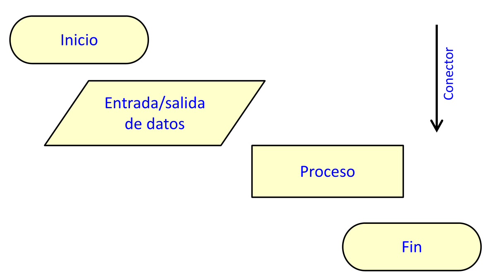
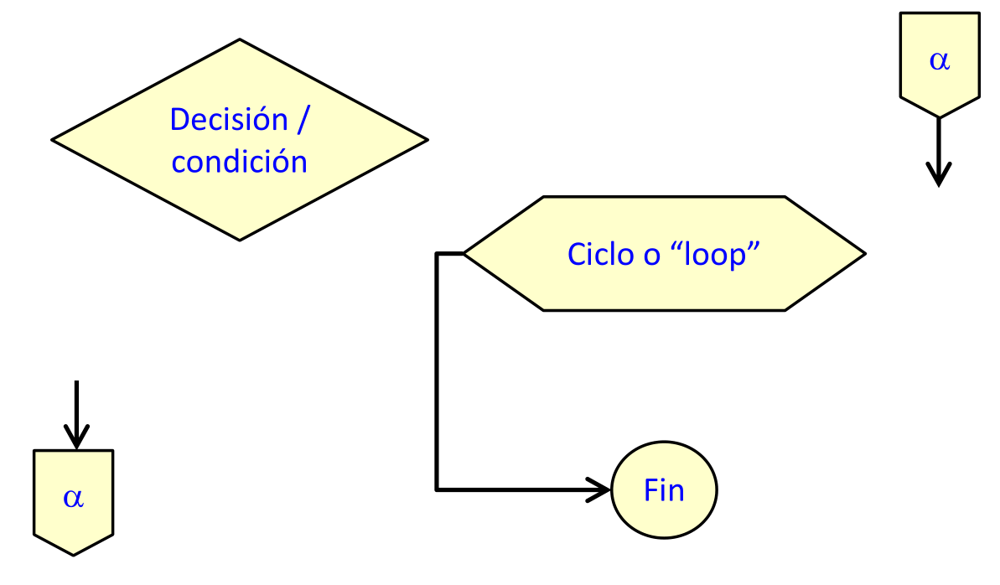
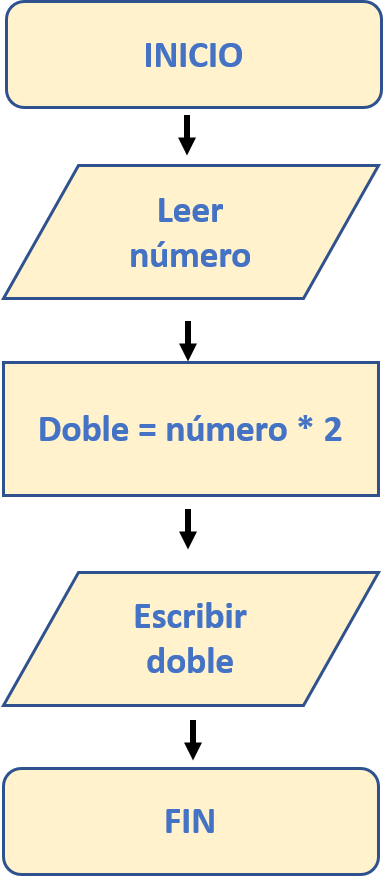
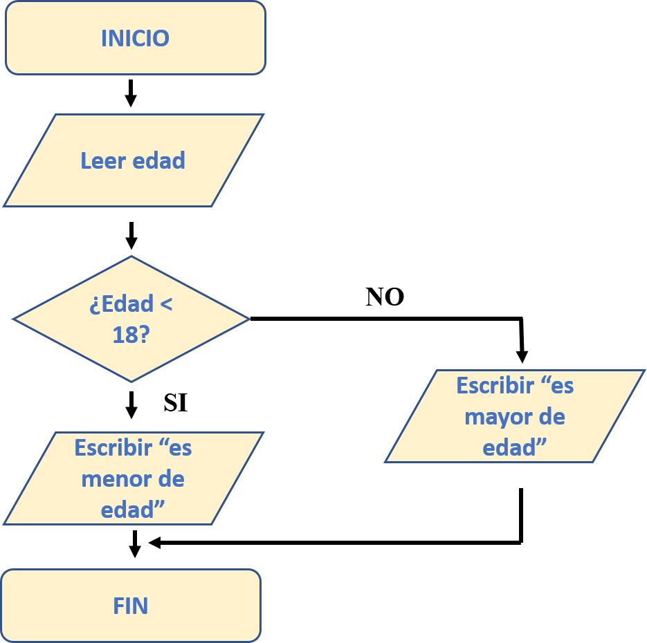
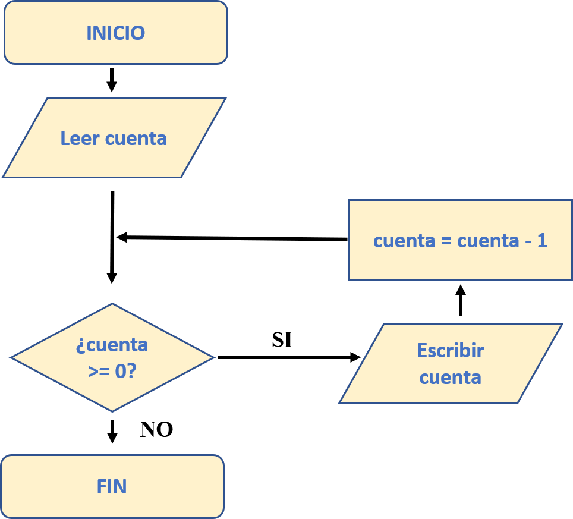
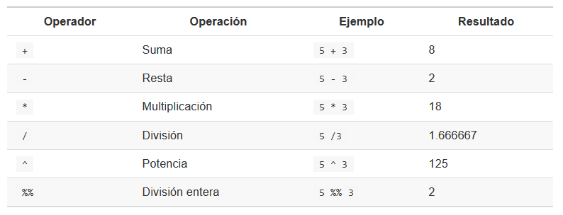
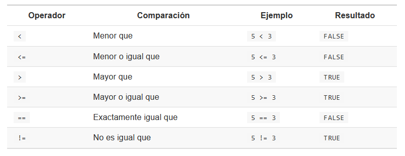
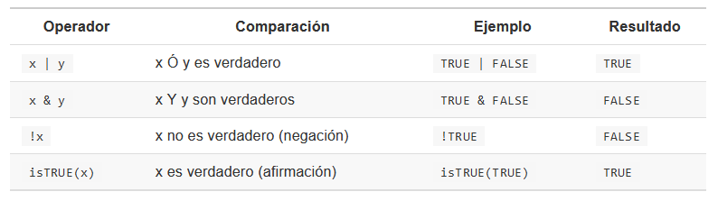

```{r echo=FALSE}
knitr::opts_chunk$set(fig.align = "center",
                      out.width = "80%",
                      echo = FALSE,
                      message = FALSE,
                      warning = FALSE)
```


```{r echo=FALSE}
#library(usethis)
#use_git()
#use_github()
#usethis::use_git_remote("origin", url = NULL, overwrite = TRUE)
```

# SEMAMA 6: Diagrama de Flujos

## Algoritmos y Diagramas de flujo

*¿Qué es un algoritmo?*
Es una secuencia ordenada de pasos que deben llevarse a cabo para resolver un problema.

*¿Qué es un diagrama de flujo?*
Un diagrama de flujo es un gráfico que contienen distintos pasos del algoritmo, utilizando símbolos según la acción que se realice en cada paso.

### Simbología

```{r}

```

```{r}

```

### Ejemplos

Ejemplo 1

Problema: Intentar describir el doble de un número ( n x 2) mediante diagramas de flujo

```{r out.width="30%"}

```

Ejemplo 2

Problema: Pedir la edad de una persona y decir si es mayor de edad o no

```{r }

```

Ejemplo 3

Problema: Dado un número positivo, disminuir el valor de ese número hasta llegar a cero.


```{r }

```

### Recomendaciones

- Analizar el problema. No hace falta tener los números para definir la secuencia de pasos (algoritmo) requeridos para resolver un problema. 

- Determinar los métodos posibles y elegir el más adecuado.

- Desarrollar un algoritmo lo más claro y conciso posible. Puede resultar tentador escribir directamente el algoritmo en el programa pero un algoritmo bien pensado y estructurado puede ahorra mucho trabajo de programación.

- Realización.

- Probar y depurar el programa.

- Documentar el programa, insertando líneas de comentarios que expliquen cada fragmento del mismo.

- Mientras más general sea el planteamiento del algoritmo y diagrama de flujo, el código y programa computacional generado será de mayor utilidad y más amplia aplicabilidad.

# SEMANA 7: Operadores en R

Tipos de operadores en R:

*Aritmetico*
Es usado para realizar operaciones aritméticos.

```{r}

```

*Relacionales*
Son usado para hacer comparaciones y siempre devuelven como resultado *TRUE* y *FALSE*.

```{r}

```


*Lógicos*
Describen relaciones lógicas, expresadas como verdadero o falso.

```{r}


```

## Proyecto individual

### Construir un dataframe

Construya un dataframe con los siguientes 6 campos y 2000 registros.

- v1: Número correlativo de la muestra (entero).

- v2: Código de estación, mismo que la tabla anterior (elegido en forma aleatoria).

- v3: Sexo de los ejemplares, muestreados aleatoriamente (asuma que hay 4 veces más hembras que machos).

- v4: Mediciones de tallas entre 70 y 130 mm, con distribución normal (media = 100 y sd = 10). En milímetros y sin decimales.

- v5: Nombre entre 5 muestreadores que tomaron la muestra (aleatorio, 1 trabaja el doble que el resto).

- v6: Variable que indica que el instrumento de medición falló (TRUE, el instrumento falla un 10% de las veces).

- Reemplace 300 registros en alguna de las columnnas de 3 a la 6 con NA. Elija una sola y reemplace estos registros al azar.

#### Solución


```{r}
estacion <- paste(rep("E",5),
                  seq(1, 5, 1),
                  sep = "_")

distNormalLimits <- 
  function(n, lw, up, nnorm, m, sd) {
  a <- rnorm(nnorm, m, sd)
  a <- round(a[a >= lw & a <= up],0)
  
  if (length(a) >= n) {
    return(sample(a, n))
  }
  stop(simpleError("No hay suficientes valores para muestrear. Intenta aumentar nnorm"))
  }
```


```{r echo=TRUE}
#Creando el dataframe
dataProyecto <- 
  data.frame(
    v1 = seq(1, 2000, 1), #Número correlativo
    v2 = sample(estacion, #Código de estación
                2000,
                replace = T),
    v3 = sample(c(0, 0, 0, 0, 1), #Sexo.4h:1m
                size = 2000,
                replace = T),
    v4 = distNormalLimits(2000, #Distr. normal
                          70,
                          140,
                          10000,
                          100,
                          10),
    v5 = sample(c("m1", #Muestreadores m5 trabajo el doble
                  "m2",
                  "m3",
                  "m4",
                  "m5",
                  "m5"),
                size = 2000,
                replace = T),
    v6 = sample(c(FALSE, TRUE), #Falla del instrumento 10% (TRUE)
                size = 2000,
                replace = TRUE,
                prob = c(0.9, 0.1)))

head(dataProyecto)

#Reemplazar registros al azar con NA
random_na <- sample(1:2000, 300)
dataProyecto$v4[random_na] <- NA

#Exportar data
#write.csv(dataProyecto, "dataProyecto.csv")
```


```{r echo=TRUE, eval=FALSE}
#Procesamiento de datos
#Importando datos
dataProyecto <- read.csv("dataProyecto.csv")

#Evaluar la presencia de NA
table(is.na(dataProyecto))

#Cuales son. Muestra posiciones.
which(is.na(dataProyecto))

#Cuales son
dataProyecto[!complete.cases(dataProyecto),]

#Total de NA
length(which(is.na(dataProyecto)))

#Eliminar NA
dataProyectoWithoutNA <- na.omit(dataProyecto)
table(is.na(dataProyectoWithoutNA))

#Haga tablas con V2 vs V5
table(dataProyectoWithoutNA$v2, dataProyectoWithoutNA$v5)
table(dataProyectoWithoutNA$v1, dataProyectoWithoutNA$v6)

#Ordenar registros por la variable v3 y luego v4
dataProyectoWithoutNA[
  with(dataProyectoWithoutNA, order(v3,v4)),
]

#Seleccionar los registros de v4 menor al tamaño medio, seleccionar unicamente los ejemplares macho.
#media
tamaMedio <- mean(dataProyectoWithoutNA$v4)

#>media
dataProyectoMachos <- 
  dataProyectoWithoutNA[dataProyectoWithoutNA$v4 < tamaMedio,]

dataProyectoMachos <- 
  dataProyectoMachos[dataProyectoMachos$v3 == 1,]

dataProyectoMachos

#Muestras totales para cada sexo vs talla
table(dataProyectoWithoutNA$v3, dataProyectoWithoutNA$v4)

#Excluir datos con errores de medicion
dataProyectoExcluidos <- dataProyectoWithoutNA[which(dataProyectoWithoutNA$v6 == TRUE),]

#Construya una lista que incluya el dataframe inicial, los datos excluidos de medición, y la base de datos depurada
list(dataProyecto, dataProyectoExcluidos, dataProyectoMachos)

```
