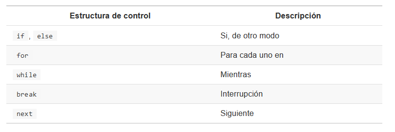

Semana 8 y 9
================

-   [1 Operadores y Estructuras de control (Sem 8
    y 9)](#operadores-y-estructuras-de-control-sem-8-y-9)
    -   [1.1 if, else](#if-else)
    -   [1.2 If else](#if-else-1)
    -   [1.3 Uso de condicionales y estructuras de control en un
        dataframe](#uso-de-condicionales-y-estructuras-de-control-en-un-dataframe)
    -   [1.4 for](#for)
        -   [1.4.1 Ejemplos](#ejemplos)
    -   [1.5 while](#while)
        -   [1.5.1 Ejemplos](#ejemplos-1)

# 1 Operadores y Estructuras de control (Sem 8 y 9)

Nos permite controlar la manera en cómo se ejecuta nuestro código
(establecen **condicionales**).

Las estructuras de control más usadas en R son las siguiente:



## 1.1 if, else

*if* se usa cuando deseamos que una operación se ejecute cuando cumple
una condición deseada (Ej. **Si** esta condición es cierta, **entonces**
haz una operación específica)

*else* se usa para indicarle a R qué hace en caso de que la condición de
un *if* no se cumpla.

La estructura de un la función *if* es la siguiente

``` r
#if (condicion) {
#  proceso_si_se_cumple_condicion
#}
```

Si la condición es verdadera, entonces se realiza la operación. En caso
contrario, no se realiza la operación. Veamos algunos ejemplos:

``` r
#Se cumple la condición y se muestra "verdadero".
if (19 > 15) {
  "verdadero"
}
```

    ## [1] "verdadero"

``` r
#Si no se cumple la condición, el código no se ejecuta.
if (10 > 15) {
  "verdadero"
}
```

la función *else* complementa a *if*, es decir, le asigna un proceso
siempre en cuando la condición inicial no se cumpla. En otras palabras,
un *if* con *else* es la manera de decirle a R:

-   **SI** esta condición es cierta, **ENTONCES** haz estas
    operaciones.**DE OTRO MODO** haz estas otras operaciones.

La estructura de in **if** con **else** es el siguiente:

``` r
#if (condition) {
#  proceso1
#} else {
#  proceso2
#}
```

Del ejemplo anterior podemos hacer las siguientes modificaciones:

``` r
#Se cumple condición
if (18 > 15) {
  "Verdadero"
} else {
  "Falso"
}
```

    ## [1] "Verdadero"

``` r
#No se cumple condición
if (10 > 15) {
  "Verdadero"
} else {
  "Falso"
}
```

    ## [1] "Falso"

Para ilustrar el uso de *if* y *else* definiremos una función que
calcule el promedio de calificaciones de un estudiante y, dependiendo de
la calificación calculada, nos devuelva un mensaje específico.

``` r
promedio <- 
  function(nota){
    mean(nota)
  }

promedio(c(5,8,9,6,5))
```

    ## [1] 6.6

Ahora realizaremos un proceso de tal forma que la función nos muestre si
un estudiante ha aprobado o no. Si asumimos que un estudiante necesita
obtener 5 o más en promedio para aprobar podemos decir:

-   **SI** el promedio de un estudiante es igual o mayor a 5,
    **ENTONCES** mostrar “Aprobado”, **DE OTRO MODO**, mostrar
    “Reprobado”.

``` r
promedio <- 
  function(notas) {
    media <- mean(notas)
    
    if (media >= 5) {
      print("Aprobado")
    } else{
      print("Desaprobado")
    }
  }
```

``` r
promedio(c(6,4,5,7,5,6))
```

    ## [1] "Aprobado"

``` r
promedio(c(3,4,4,4,5,3))
```

    ## [1] "Desaprobado"

## 1.2 If else

La función *ifelse()* permite vectorizar if, else. En lugar de escribir
una línea de código para cada comparación, podemos usar una sola llamada
a esta función, que se aplicará a todos los elementos de un vector.

Si intentamos usar if else con un vector, se nos mostrará una
advertencia:

``` r
if (1:10 < 3) {
  "Verdadero"
}
```

    ## [1] "Verdadero"

El mensaje muestra que la condición sólo es evaluada para el primer
elemento del vector 1:10, es decir para 1. Los demás elementos son
ignorados.

Por el contrario, con *ifelse* le indicamos que la condición debe de
cumplirse para cada uno de los elementos del vector. Esta función tiene
tres argumentos:

-   un vector

-   un valor que indique qué mostrar si la condición se cumple

-   un valor que indique qué mostrar si la condición no se cumple

``` r
vector <- 1:10
ifelse(vector > 5, "TRUE", "FALSE")
```

    ##  [1] "FALSE" "FALSE" "FALSE" "FALSE" "FALSE" "TRUE"  "TRUE"  "TRUE"  "TRUE" 
    ## [10] "TRUE"

``` r
edad <- c(10,15,17,19, 20, 13, 11, 16, 15)

ifelse(edad >= 15, "TRUE", "FALSE")
```

    ## [1] "FALSE" "TRUE"  "TRUE"  "TRUE"  "TRUE"  "FALSE" "FALSE" "TRUE"  "TRUE"

``` r
#Determinar cual de los números del 1 al 60 son pares y cuales impares ¿que se debe cumplir?

numeros <- 1:60
ifelse(numeros %% 2 == 0, "par", "impar")
```

    ##  [1] "impar" "par"   "impar" "par"   "impar" "par"   "impar" "par"   "impar"
    ## [10] "par"   "impar" "par"   "impar" "par"   "impar" "par"   "impar" "par"  
    ## [19] "impar" "par"   "impar" "par"   "impar" "par"   "impar" "par"   "impar"
    ## [28] "par"   "impar" "par"   "impar" "par"   "impar" "par"   "impar" "par"  
    ## [37] "impar" "par"   "impar" "par"   "impar" "par"   "impar" "par"   "impar"
    ## [46] "par"   "impar" "par"   "impar" "par"   "impar" "par"   "impar" "par"  
    ## [55] "impar" "par"   "impar" "par"   "impar" "par"

Otro ejemplo más complejo. Solicitamos sólo los números que son
exactamente divisibles entre 2 y 3.

``` r
numeros <- 1:20

ifelse(numeros %% 2 == 0 & numeros %% 3 == 0,
       "Divisible",
       "No divisible")
```

    ##  [1] "No divisible" "No divisible" "No divisible" "No divisible" "No divisible"
    ##  [6] "Divisible"    "No divisible" "No divisible" "No divisible" "No divisible"
    ## [11] "No divisible" "Divisible"    "No divisible" "No divisible" "No divisible"
    ## [16] "No divisible" "No divisible" "Divisible"    "No divisible" "No divisible"

Conocer esta función puede ser particularmente útil para recodificar
datos. Por ejemplo:

``` r
sexo <- c(0, 1, 0, 0, 0, 0, 0, 1, 1, 0)
sexo <- ifelse(sexo == 0, "hembra", "macho")
sexo
```

    ##  [1] "hembra" "macho"  "hembra" "hembra" "hembra" "hembra" "hembra" "macho" 
    ##  [9] "macho"  "hembra"

## 1.3 Uso de condicionales y estructuras de control en un dataframe

Recordemos que para hacer uso de las condicionales podemos hacer uso de
las funciones *if*, *else*, *if else* y/o uso de indexaciones combinado
con operadores lógicos y/o relacionales.
(<https://github.com/AngeloCris/computacionCientifica_2021/blob/master/semana7_8/Semana7-y-8.md>).

``` r
datosCrangrejo <- 
  read.table("datos/datos_cangrejos.txt",
             sep = ",",
             header = TRUE)
datosCrangrejo
```

Para determinar el total de filas de mi data frame usamos la función
*length*.

``` r
attach(datosCrangrejo)
length(datosCrangrejo$Year)
```

    ## [1] 71013

La base de datos muestra los registros mensuales de la longitud y sexo
de un cangrejo para el periodo 2008 y 2014. En función a lo mencionado
anteriormente, resolvamos lo siguiente.

-   Crear una columna denominada “sexo” que reemplace las categorías de
    la columna “sex”. Considere lo siguiente

    -   “F” = “female”

    -   “0” = “ovígera”

``` r
#Uso del ifelse
#Para condicionales vectorizados
unique(datosCrangrejo$Sex)
datosCrangrejo$sexo <- 
  ifelse(datosCrangrejo$Sex == "F", "Females", "Ovigera")
head(datosCrangrejo)
table(datosCrangrejo$sexo)
```

-   Crear una columna denominada “estacion” que reemplace las categorías
    de la columna “Month”. Considere lo siguiente:

    -   verano = 12, 1, 2

    -   otoño = 3, 4, 5

    -   invierno = 6, 7, 8

    -   primavera = 9, 10, 11

``` r
datosCrangrejo$estacion <- "NA"
datosCrangrejo$estacion[datosCrangrejo$Month %in% c(12,1,2)] <- "verano" 
datosCrangrejo$estacion[datosCrangrejo$Month %in% c(3,4,5)] <- "otoño"
datosCrangrejo$estacion[datosCrangrejo$Month %in% c(6,7,8)] <- "invierno"
datosCrangrejo$estacion[datosCrangrejo$Month %in% c(9,10,11)] <- "primavera"
head(datosCrangrejo)
```

    ##   Year   Sector Month Sex C_Length    sexo  estacion
    ## 1 2013 Sector_1    11   F   123.64 Females primavera
    ## 2 2013 Sector_1    11   F   118.47 Females primavera
    ## 3 2013 Sector_1    11   F   115.53 Females primavera
    ## 4 2013 Sector_1    11   F   113.98 Females primavera
    ## 5 2013 Sector_1    11   F   108.75 Females primavera
    ## 6 2013 Sector_1    11   F   106.12 Females primavera

-   Determinar las posiciones de la categoría “primavera” y luego
    determinar los valores que se asocian a esas posiciones.

``` r
#Deseamos extraer las posiciones de las categorías que pertenecen a la estación primavera.
which(datosCrangrejo$estacion == "primavera")

#Extrayendo los valores de las variables de esta categoría
datosCrangrejo[which(datosCrangrejo$estacion == "primavera"),]
```

-   Extraer todos los registros de cangrejos que superan la talla media.

``` r
media <- mean(datosCrangrejo$C_Length, na.rm = T)

head(which(datosCrangrejo$C_Length > media))
```

    ## [1] 1 2 3 4 5 6

``` r
head(datosCrangrejo[which(datosCrangrejo$C_Length > media),])
```

    ##   Year   Sector Month Sex C_Length    sexo  estacion
    ## 1 2013 Sector_1    11   F   123.64 Females primavera
    ## 2 2013 Sector_1    11   F   118.47 Females primavera
    ## 3 2013 Sector_1    11   F   115.53 Females primavera
    ## 4 2013 Sector_1    11   F   113.98 Females primavera
    ## 5 2013 Sector_1    11   F   108.75 Females primavera
    ## 6 2013 Sector_1    11   F   106.12 Females primavera

``` r
head(datosCrangrejo[datosCrangrejo$C_Length > media,])
```

    ##   Year   Sector Month Sex C_Length    sexo  estacion
    ## 1 2013 Sector_1    11   F   123.64 Females primavera
    ## 2 2013 Sector_1    11   F   118.47 Females primavera
    ## 3 2013 Sector_1    11   F   115.53 Females primavera
    ## 4 2013 Sector_1    11   F   113.98 Females primavera
    ## 5 2013 Sector_1    11   F   108.75 Females primavera
    ## 6 2013 Sector_1    11   F   106.12 Females primavera

-   Extraer todos los registros de cangrejos hembras que superan la
    talla media.

``` r
datosCrangrejo$C_Length > media
which(datosCrangrejo$C_Length > media & datosCrangrejo$sexo == "Females")

head(datosCrangrejo[which(datosCrangrejo$C_Length > media & datosCrangrejo$sexo == "Females"),])
```

-   Asumamos que la mínima talla de extracción de la especie de cangrejo
    sea 110 mm. Crear una columna que identifique si la longitud
    registrada supera o no la talla mínima.

``` r
tmin <- 110
datosCrangrejo$lengthMin <- "NA"
datosCrangrejo$lengthMin <- ifelse(datosCrangrejo$C_Length > 110, ">tmin", "<tmin")
head(datosCrangrejo)
```

    ##   Year   Sector Month Sex C_Length    sexo  estacion lengthMin
    ## 1 2013 Sector_1    11   F   123.64 Females primavera     >tmin
    ## 2 2013 Sector_1    11   F   118.47 Females primavera     >tmin
    ## 3 2013 Sector_1    11   F   115.53 Females primavera     >tmin
    ## 4 2013 Sector_1    11   F   113.98 Females primavera     >tmin
    ## 5 2013 Sector_1    11   F   108.75 Females primavera     <tmin
    ## 6 2013 Sector_1    11   F   106.12 Females primavera     <tmin

## 1.4 for

La estructura *for* permite ejecutar bucles realizando una operación
para cada elemento de un conjunto de datos, es decir, hace un proceso de
iteración.

``` r
#la estructura es
#for (variable in vector) {
#  proceso
#}
```

Esta estructura le dice a R:

-   **PARA** cada elemento **EN** un objeto, realice un proceso
    específico.

Cuando observamos la estructura del bucle, la “variable” puede ser un
elemento cualquiera (la podemos llamar como nosotros queramos) pero el
objeto “vector” tiene que ser un objeto existente.

### 1.4.1 Ejemplos

-   Sumarle 2 unidades a cada elemento del objeto “vector” definido
    líneas abajo:

``` r
vector <- 5:10

vector[1] + 2
```

    ## [1] 7

``` r
vector[2] + 2 
```

    ## [1] 8

``` r
vector[3] + 2
```

    ## [1] 9

``` r
vector[4] + 2
```

    ## [1] 10

``` r
vector[5] + 2
```

    ## [1] 11

``` r
for (i in length(vector)) {
  vector1 <- vector[i] + 2

}

vector1
```

    ## [1] 12

-   Si deseamos imprimir vectores con la siguiente forma: “El año es x”,
    donde x es igual a 1990, 1991, 1992, … , 2020 y 2021. Esto se podría
    realizar de la siguiente manera:

``` r
print(paste("El año es", 1990))
```

    ## [1] "El año es 1990"

``` r
print(paste("El año es", 1991))
```

    ## [1] "El año es 1991"

``` r
print(paste("El año es", 1992))
```

    ## [1] "El año es 1992"

``` r
print(paste("El año es", 1993)) #asi sucesivamente
```

    ## [1] "El año es 1993"

``` r
print(paste("El año es", 2019))
```

    ## [1] "El año es 2019"

``` r
print(paste("El año es", 2020))
```

    ## [1] "El año es 2020"

``` r
print(paste("El año es", 2021))
```

    ## [1] "El año es 2021"

Cuando la longitud del vector x es grande, este proceso se vuelve
tedioso. En este caso se recomientda usar un loop en R para que el
proceso se repita continuamente.

``` r
for (year in 1990:2021) {
  print(paste("El año es", year))
}
```

-   Calcular el cuadrado de los 10 primeros elementos de un vector u1

``` r
#Vector u1
u1 <- rnorm(30)
print("Este loop calculará el cuadrado de los 10 primeros elementos del vector u1")
```

    ## [1] "Este loop calculará el cuadrado de los 10 primeros elementos del vector u1"

``` r
usq <- 0

for (i in 1:10) {
  usq[i] <- u1[i] * u1[i]
  print(usq[i])
}
```

    ## [1] 0.2781869
    ## [1] 0.187935
    ## [1] 0.01858888
    ## [1] 0.4093865
    ## [1] 0.06201796
    ## [1] 0.02536765
    ## [1] 4.507466
    ## [1] 4.230216
    ## [1] 1.721087
    ## [1] 0.01028793

## 1.5 while

Tipo de bucle que realizará un proceso **mientras** la condición
propuesta sea **verdadera**.

``` r
#while (condicion) {
#  operaciones
#}
```

### 1.5.1 Ejemplos

-   Imprimir el siguiente mensaje “Cuando el valor de inicio sea mayor o
    igual a 5, detener operación” donde la variable “límite” es igual a
    5 y la variable “inicio”, 0.

``` r
limite <- 5
inicio <- 0

while (inicio < limite) {
  print("Cuando el valor de inicio sea mayor o igual a 5, detener operación")
  inicio <- inicio + 1
}
```

    ## [1] "Cuando el valor de inicio sea mayor o igual a 5, detener operación"
    ## [1] "Cuando el valor de inicio sea mayor o igual a 5, detener operación"
    ## [1] "Cuando el valor de inicio sea mayor o igual a 5, detener operación"
    ## [1] "Cuando el valor de inicio sea mayor o igual a 5, detener operación"
    ## [1] "Cuando el valor de inicio sea mayor o igual a 5, detener operación"

Tener cuidado con crear bucles infinitos! Si se ejecuta el While con una
condición que nunca termine, este no se detendrá.

``` r
#while (inicio < limite) {
#  print("Cuando el valor de inicio sea mayor a 5, detener la operación")
#}
```

-   Realizar un proceso iteración (10 veces) donde se muestre el mensaje
    “Este es el loop número x”. Sea x el número de la iteración.

``` r
#Crear una variable con valor 1
inicio <- 1

#Create un loop
while (inicio <= 10) {
  cat("Este es el loop número", inicio)
  inicio <- inicio + 1
  print(inicio)
}
```

    ## Este es el loop número 1[1] 2
    ## Este es el loop número 2[1] 3
    ## Este es el loop número 3[1] 4
    ## Este es el loop número 4[1] 5
    ## Este es el loop número 5[1] 6
    ## Este es el loop número 6[1] 7
    ## Este es el loop número 7[1] 8
    ## Este es el loop número 8[1] 9
    ## Este es el loop número 9[1] 10
    ## Este es el loop número 10[1] 11

-   Deseamos conocer el primer número entero positivo cuyo cuadrado
    exceda a 4000:

``` r
#Variable de inicialización
n <- 0
potencia <- 0

#While loop
while (potencia <= 4000) {
  n <- n + 1 #definiendo número entero positivo
  potencia <- n ^ 2 #definiendo el cuadrado de ese número
}
```

-   Suma de dos vectores

``` r
x <- c(1, 2, 3, 4)
y <- c(0, 0, 5, 1)
n <- length(x)
i <- 0
z <- numeric(n)

while (i <= n) {
  z[i] <- x[i] + y[i]
  i <- i + 1
}

z
```

    ## [1] 1 2 8 5

-   Extraer un número al azar de una secuencia numérica del 1 al 10
    hasta que la suma de sus elementos extraídos sea menor a 50. Indicar
    el número de iteraciones y la suma resultante.

``` r
contador <- 0
suma <- 0

while (suma < 50) {
  suma <- suma + sample(x = 1:10, size = 1)
  contador <- contador + 1
}
```

En clase se vió un ejemplo en donde los elementos de un vector x
correspondían a conteos de animales avistados a lo largo de un
transecto. Solicitaban encontrar en punto a lo largo del transecto en
que el número acumulado de animales avistados es al menos 50

``` r
x <- c(1,0,1,2,1,4,7,2,6,1,8,2,0,3,0,10,8,5,4,5,8,2,0,5,8)
sum <- 0
i <- 0

while (sum > 50) {
  i = i + 1
  sum = sum + x[i]
  print(sum)
}
```
